Apa yang dimaksud dengan Git sebuah system versioning control (sistem kontrol versi) terdistribusi.Ada beberapa macam Git yaitu: * Git vesion controling 
									        * Git Hub
									        * Git clone     				                                                * Git Status
				                                                * Git Add
  			 	   	                                        * Git commit -m
						                                * Git push
				                                                * Git Pull
						                                

 Fungsi-fungsi Git:

* Fungsi GitHub adalah membuat server
* Fungsi Git Version Controling adalah Mengambil perubahan yang ada di Repo
* Fungsi Git Clone adalah Mengcopy atau mengambil repository,project,file yang ada di GitHub
* Fungsi Git status adalah Melihat status perubahan yang kita buat (di laptop kita)
* Fungsi Git add adalah Memilih file yang akan di commit
* Fungsi Git commit -m adalah Untuk menyimpan file di repo local
* Fungsi Git push adalah Meletekan ke server pusat
* Fungsi Git pull adalah Untuk mengambil perubahan terbaru dari repo pusat (server)

Jangan lupa menggunakan ssh .ssh berfungsi membuat generiknya.

Langkah Pertama kita install Git

sudo apt-get install git-core jangan lupa pasword anda masukkan

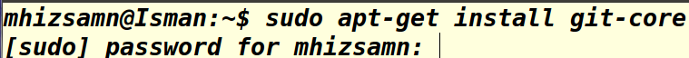\

Selesai menginstall kita tinggal menjalankan.lalu kita mengetik config.config ini berfungsi untuk meletakan konfigurasi Git .

\

lalu kita copy atau mengambil repository yang ada di Github caranya kita masuk klik sign in 

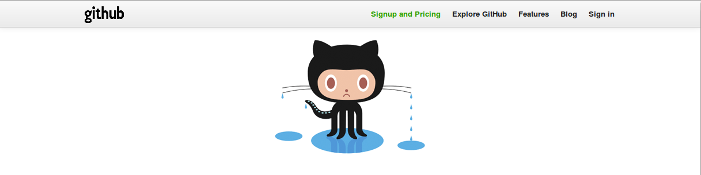\

baru kita isi Email dan Paswordnya.Emailnya email google kalau yang belum ada email googlenya silahkan anda daftar tapi yang sudah ada email googlenya tinggal masuk ke Github caranya seperti di bawah ini:

SIGN IN

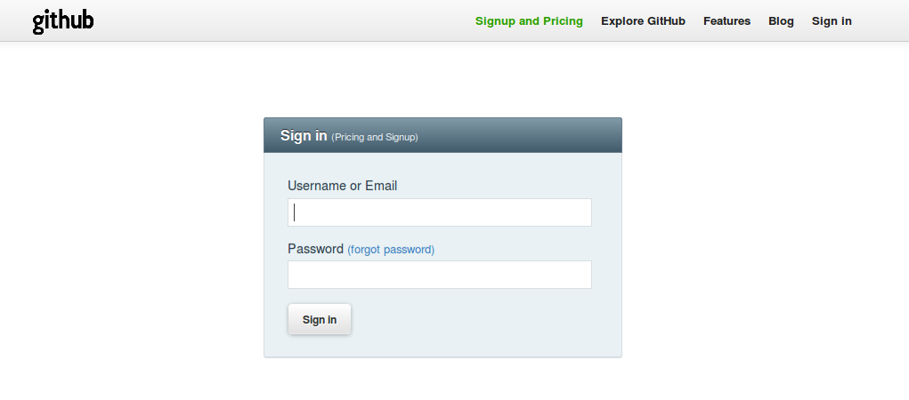\

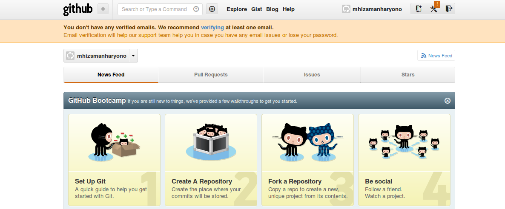\

Selesai masuk ke Github .Baru kita masuk ke profile Github

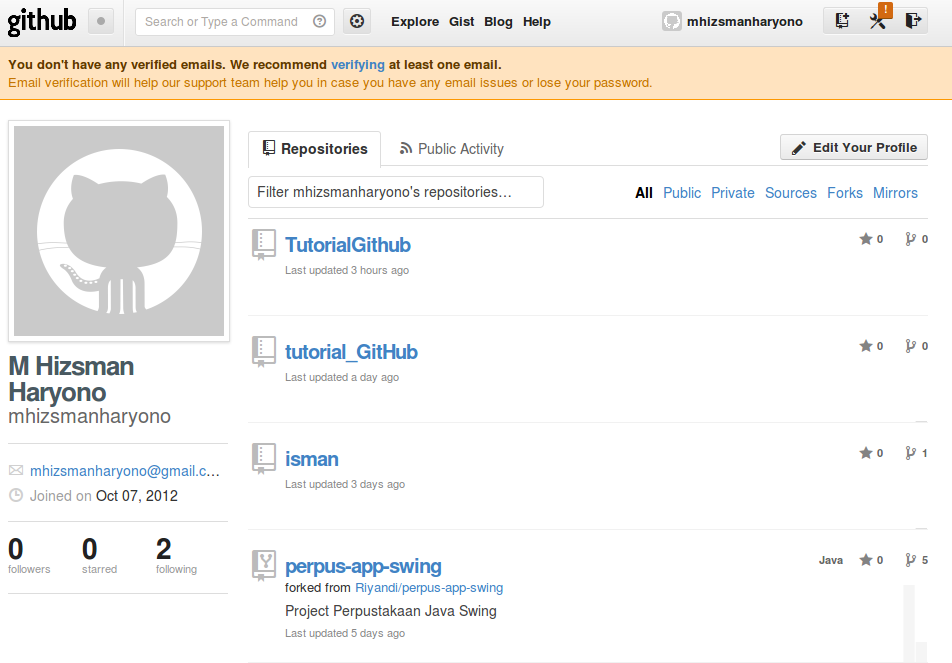\

Kalau kita ingin membuat repo atau folder Baru kita sekarang masuk ke New repo .Caranya klik sudut kanan paling atas yang ada sebelah nama akun Github kita\ Lalu kita masuk ke new reponya terus kita isi new reponya.

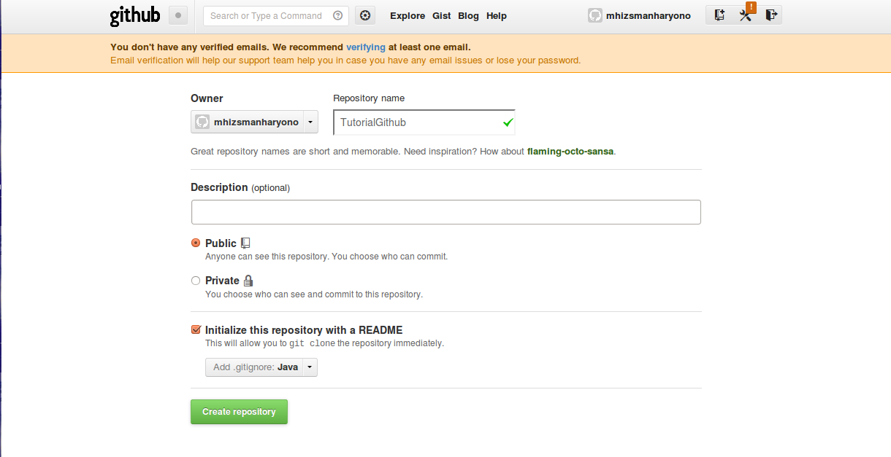\

Lalu create Repository.Hasil habis di create repository.

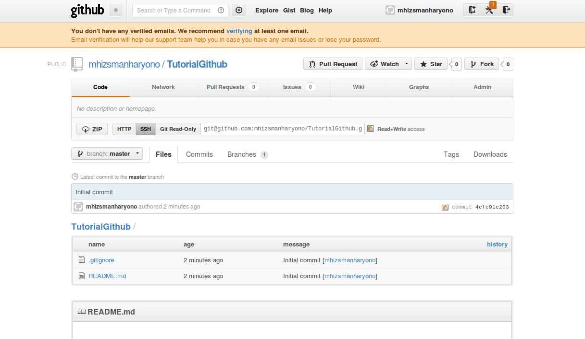\

Baru kita mau buat Clone repository nya caranya kita copy ssh nya selesai kita copy baru kita ketik di terminal fungsinya untuk Mengcopy atau mengambil repository,project,file yang ada di GitHub.

\

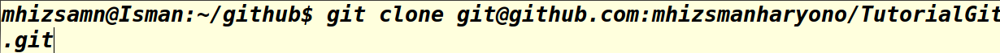\

Lalu kita memilih file yang akan kita commit dengan cara membuat Git Repository .klik di terminal.

Git add .

\

Kalau kita ingin melihat status perubahan nya cara nya klik di terminal :

Git status

\

lalu kita menyimpan dengan repo local caranya.klik di terminal

git commit -m "coba"

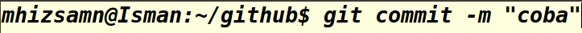\

Lalu mengambil perubahan ke repo local .caranya klik di terminal

git pull

\

Baru kita letakan ke server pusat dengan cara melakukannya

git push

\

setelah sudah selesai semua .lalu kita edit Githubnya tadi new reponya uda selesai kita buat sama create repository nya sudah selesai.sekarang kita ingin mengefork. fungsi fork mengecon repo yang mau di copy ke Github saya. cara nya kita search \ yang kita copy foldernya .Lalu muncul orang yang kita Search Results. terus kita klik  \ sesudah kita klik muncul gambar profile yang kita search tadi .

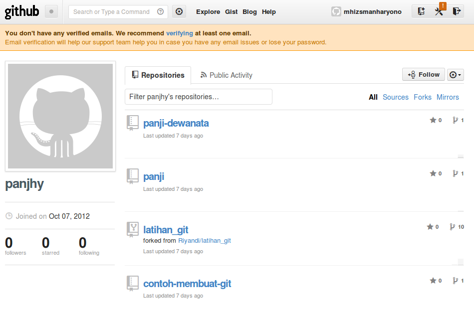\

sesudah kita masuk kedalam folder latihan git-hub lalu kita mengefork .cara nya klik di sudut kanan paling atas.

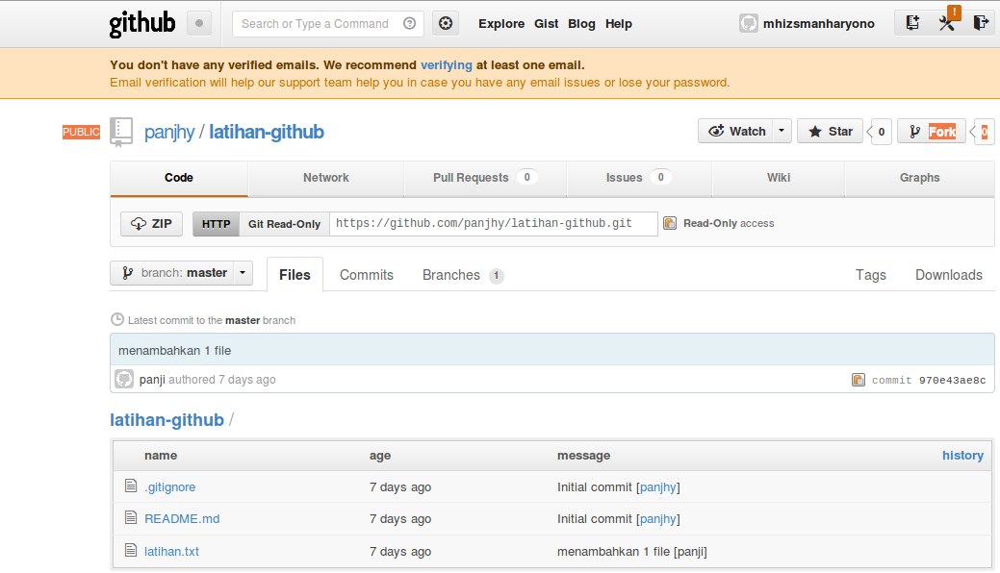\

\

Selesai mengcopy ,Sekarang kita mengePull Request .Fungsi Pull Request mengirim folder orang yang ke kita dari orang yang folder nya kita copy tadi .cara nya klik Pull Request.

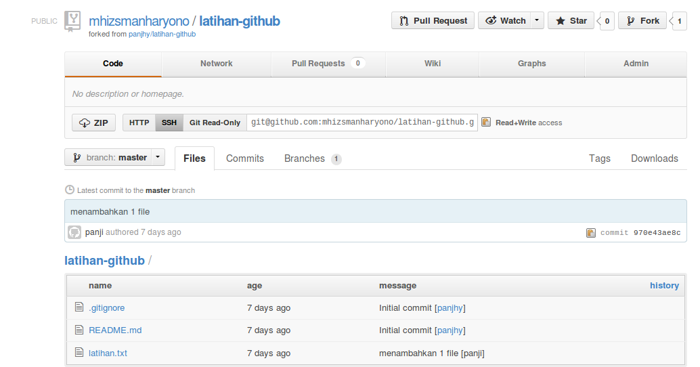\

Lalu kita klik terus muncul gambar folder yang mau kita kirim.

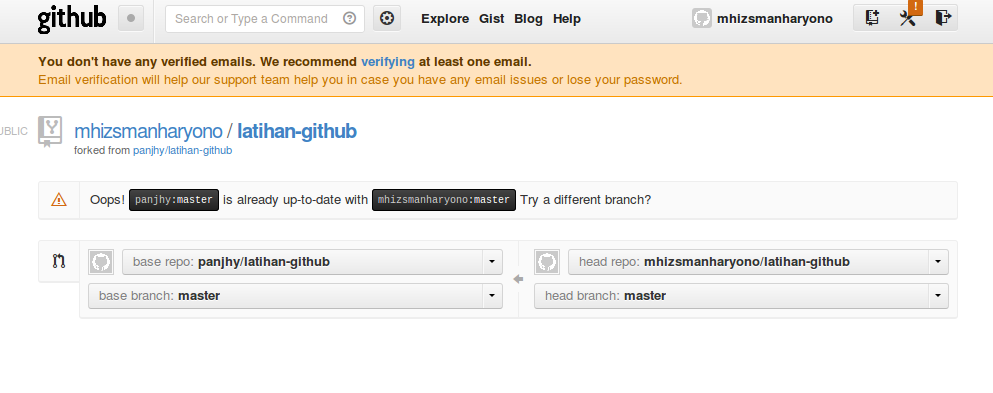\

kalau sudah kita jalani yang di sebelah kanan \ kalau sudah maka muncul gambar profile kita dan hasil yang kita jalan kan ada.

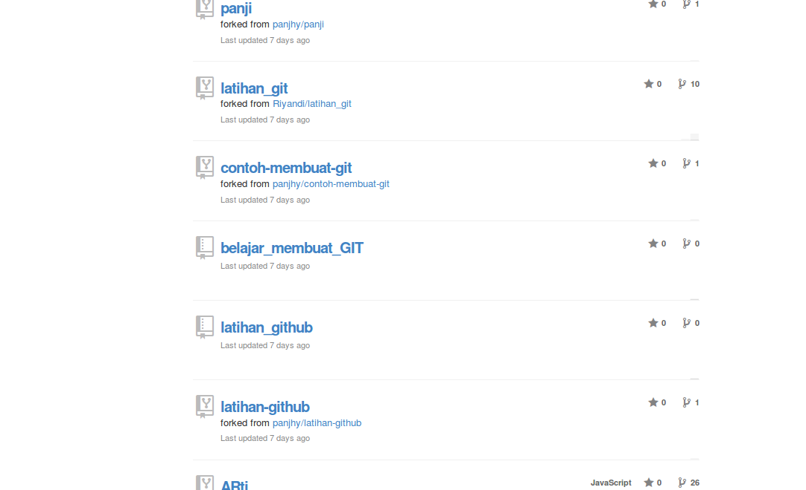\

